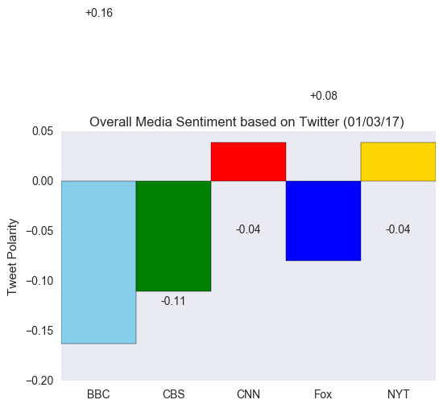

# Tweet Sentiments Analysis

`tweet_analysis.ipynb` will guide through how to perform a sentiment analysis of the Twitter activity of various news outlets, and to plot the data using matplotlib.

* The tools include the following: tweepy, pandas, matplotlib, and VADER.
* following news organizations are selected: **BBC, CBS, CNN, Fox, and New York times**.

1. The first plot features the following:

* A scatter plot of sentiments of the last 100 tweets sent out by each news organization, ranging from -1.0 to 1.0, where a score of 0 expresses a neutral sentiment, -1 the most negative sentiment possible, and +1 the most positive sentiment possible.
* Each plot point reflects the _compound_ sentiment of a tweet.
* Sort each plot point by its relative timestamp.

2. The second plot is a bar plot visualizing the _overall_ sentiments of the last 100 tweets from each organization. 

